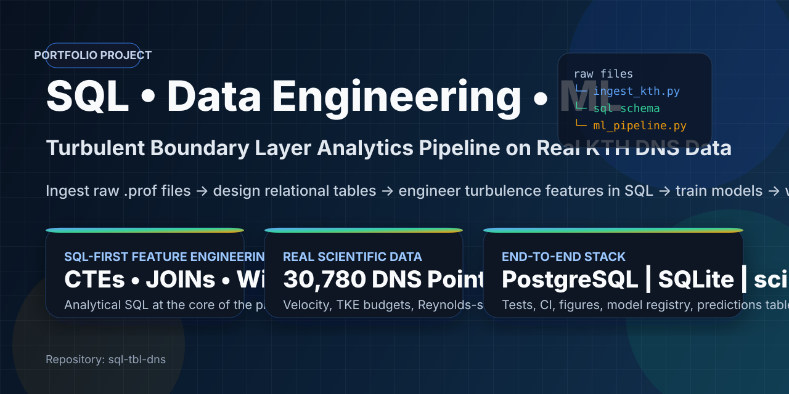
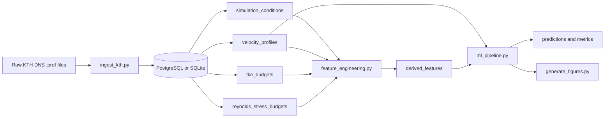
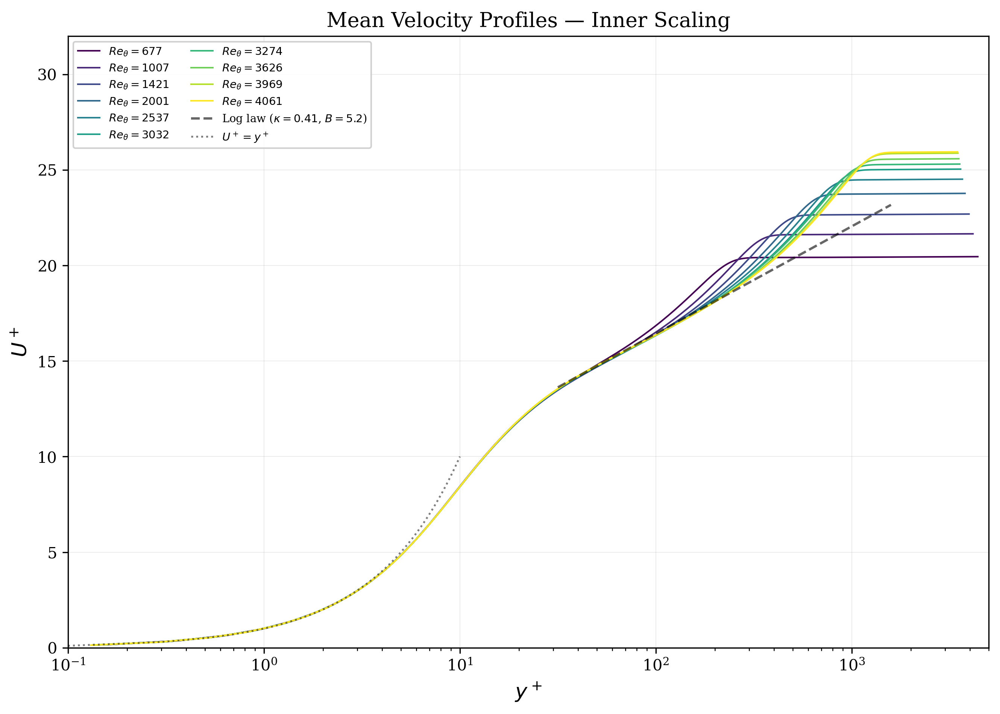
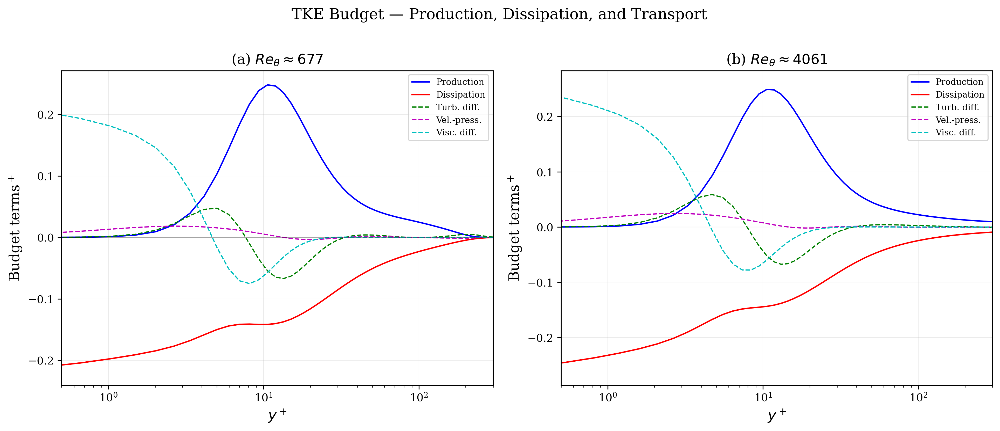
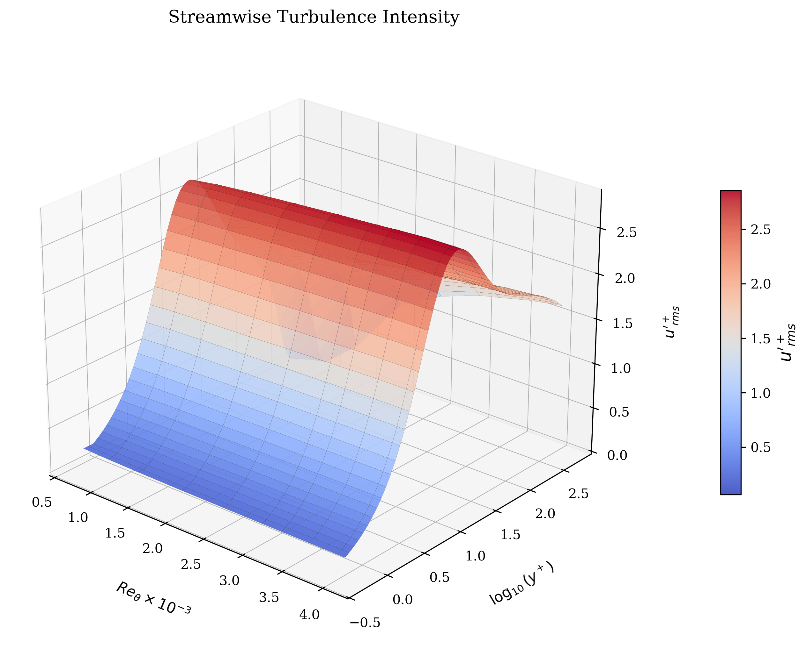
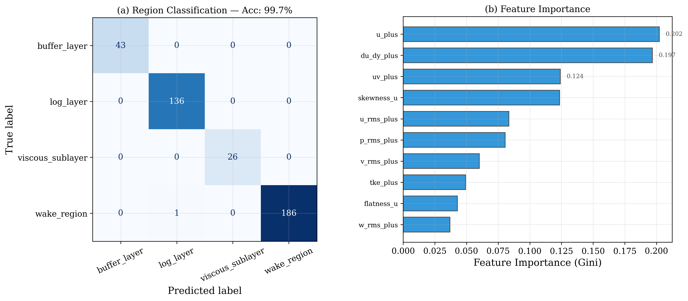

<p align="center">
  
</p>

<p align="center">
  <a href="https://github.com/4nechoic-hub/sql-tbl-dns/actions/workflows/ci.yml"></a>
  
  
  
</p>

# Turbulent Boundary Layer SQL Analytics Pipeline

A SQL-first data engineering and machine learning pipeline built on real KTH direct numerical simulation (DNS) data for a turbulent zero-pressure-gradient boundary layer.

## Overview

This project ingests raw `.prof` files from the KTH Boundary Layer dataset into a relational database, engineers turbulence features with SQL, trains machine learning models, and generates analysis figures.

It is designed to demonstrate more than notebook-based analysis:

- ingestion of real scientific data into a relational database
- relational schema design for simulation metadata, velocity profiles, and turbulence budgets
- SQL-based feature engineering for downstream ML tasks
- supervised and unsupervised machine learning on engineered features
- reproducible testing and CI automation across SQLite and PostgreSQL

## What I built

The upstream DNS profile and budget files are external research data.

My original work in this repository includes:

- the ingestion pipeline in `src/ingest_kth.py`
- the database utilities and schema initialization flow in `src/db.py`
- SQL-first feature engineering in `src/feature_engineering.py`
- the ML workflow in `src/ml_pipeline.py`
- reporting and figure generation in `src/generate_figures.py`
- automated tests, Docker setup, and CI configuration

## Why this is a SQL-first project

SQL is central to this repository, not an afterthought. The database is used to store simulation data, organize turbulence quantities, and compute derived ML-ready features before model training. Python mainly orchestrates ingestion, model execution, and reporting.

Core tables include:

- `simulation_conditions`
- `velocity_profiles`
- `tke_budgets`
- `reynolds_stress_budgets`
- `derived_features`
- `predictions`
- `model_registry`

## Pipeline architecture



## Models and outputs

The pipeline currently includes three analysis tasks:

- boundary-layer region classification with a Random Forest pipeline evaluated with leave-one-condition-out validation
- `Re_tau` regression with gradient boosting evaluated with leave-one-condition-out validation
- anomaly detection with Isolation Forest and Local Outlier Factor

This makes the project useful as a portfolio piece for SQL, data engineering, analytics engineering, scientific Python, and applied machine learning roles.

## Selected outputs

<p align="center">
  
  
</p>
<p align="center">
  
  
</p>

These figures are generated directly from the pipeline after ingestion, feature engineering, and model execution. The README gallery is intentionally curated; the full figure set can be reproduced locally.

## Repository structure

```text
sql-tbl-dns/
├── .github/workflows/          # CI pipeline
├── data/raw/kth_dns/           # Raw DNS input files
├── docs/assets/figures/        # Curated README figure gallery
├── sql/
│   ├── queries/                # Exploratory and feature SQL
│   └── schema/                 # SQLite and PostgreSQL schema files
├── src/
│   ├── config.py
│   ├── db.py
│   ├── feature_engineering.py
│   ├── generate_figures.py
│   ├── ingest_kth.py
│   └── ml_pipeline.py
├── tests/
│   └── test_pipeline.py
├── CITATION.cff
├── DATA_PROVENANCE.md
├── docker-compose.yml
├── hero-banner.svg
├── LICENSE
├── README.md
├── requirements.txt
└── requirements-dev.txt
```

## What to review first

If you are scanning this repository quickly, start here:

1. `src/ingest_kth.py` for parsing and loading the DNS files
2. `src/feature_engineering.py` for SQL-based feature extraction
3. `src/ml_pipeline.py` for classification, regression, and anomaly detection
4. `sql/queries/02_feature_engineering.sql` for standalone SQL work
5. `.github/workflows/ci.yml` for reproducibility and automated checks

## Quick start

### Local SQLite run

```bash
git clone https://github.com/4nechoic-hub/sql-tbl-dns.git
cd sql-tbl-dns

python -m venv .venv
source .venv/bin/activate
pip install -r requirements.txt

python src/ingest_kth.py --data-dir data/raw/kth_dns --backend sqlite
python src/ml_pipeline.py --backend sqlite
python src/generate_figures.py --backend sqlite --db-path data/tbl_analytics.db
```

### PostgreSQL run

```bash
cp .env.example .env
docker compose up -d postgres

python src/ingest_kth.py --data-dir data/raw/kth_dns --backend postgresql
python src/ml_pipeline.py --backend postgresql --output-dir data/processed_postgres
python src/generate_figures.py --backend postgresql --output-dir data/processed_postgres
```

## Testing

```bash
pip install -r requirements-dev.txt
pytest tests/ -v --tb=short
```

GitHub Actions runs a SQLite test matrix and a PostgreSQL smoke test on pushes and pull requests to `main`.

## CI artifacts

The PostgreSQL smoke test uploads the generated figure set as a workflow artifact named `postgres-figures`. After a successful run, open **Actions**, select the workflow run, and download the artifact from the **Artifacts** section.

## Dataset provenance and attribution

This repository uses data from the KTH Boundary Layer Data portal. The relevant upstream DNS release was last updated on 2012-05-27 and is associated with:

> Schlatter, P. and Orlu, R. (2010). *Assessment of direct numerical simulation data of turbulent boundary layers*. Journal of Fluid Mechanics, 659, 116-126. https://doi.org/10.1017/S0022112010003113

The upstream data description notes that the directory contains integral quantities and velocity profiles for a turbulent zero-pressure-gradient boundary layer, and asks users to include proper references to the original publications.

For this repository, the DNS files span 10 Reynolds-number cases from `Re_theta = 670` to `Re_theta = 4060`.

Please keep the dataset attribution with the original publication. The repository code is MIT licensed, but the upstream research data should retain its original citation and attribution requirements.

See `DATA_PROVENANCE.md` for the dataset note in repository form.

## Current limitations

- evaluation is now group-aware by Reynolds-number condition, but the dataset still contains only 10 conditions for supervised learning
- the boundary-layer region labels are rule-based surrogate labels derived from wall-normal thresholds rather than external annotations
- anomaly detection is exploratory and unsupervised rather than benchmarked against labeled anomalies
- the README gallery shows selected outputs only; the full figure set is reproduced locally and uploaded from CI as an artifact

## References

- Schlatter, P. and Orlu, R. (2010). *Assessment of direct numerical simulation data of turbulent boundary layers*. Journal of Fluid Mechanics, 659, 116-126. https://doi.org/10.1017/S0022112010003113
- KTH Boundary Layer Data portal: https://www.mech.kth.se/~pschlatt/DATA/

## License

MIT License for repository code. Upstream DNS data remains subject to its original attribution and citation requirements.
