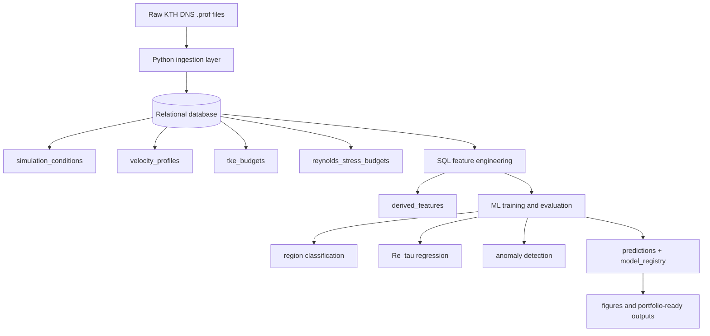

<p align="center">
  
</p>

<p align="center">
  <a href="LICENSE"></a>
  
  
  
  
  
</p>

# Turbulent Boundary Layer SQL Analytics Pipeline

A SQL-first data engineering and machine learning project built on real direct numerical simulation data from KTH Royal Institute of Technology. The pipeline ingests turbulent boundary layer profile files, loads them into a relational database, engineers physically meaningful features in SQL, trains machine learning models, and writes model outputs back to the database.

## Why this project matters

Most portfolio projects stop at a notebook. This project is intentionally structured as a reproducible pipeline that shows:

- data ingestion from raw scientific files into a relational database
- relational schema design and SQL-based feature engineering
- machine learning on engineered turbulence features
- test coverage and CI automation
- figure generation and results reporting

This makes it a stronger signal for data engineering, analytics engineering, scientific Python, and applied machine learning roles.

## What I built vs. what I used

This repository is strongest when it is framed honestly:

- **External research data**: the raw DNS profile and budget files come from the KTH Boundary Layer Data portal.
- **Original portfolio work**: the ingestion code, schema design, SQL feature engineering, ML pipeline, reporting workflow, tests, and CI setup are my implementation.
- **Portfolio objective**: demonstrate end-to-end SQL, data engineering, and applied ML on a real scientific dataset rather than claim ownership of the underlying simulation campaign.

That framing makes the project more credible to technical reviewers.

## Dataset provenance and attribution

This project uses the **KTH Boundary Layer Data** portal maintained by Philipp Schlatter and collaborators.

For this repository, the relevant upstream source is the **"new DNS Data"** release last updated **2012-05-27**, associated with:

> Schlatter, P. and Orlu, R. (2010). *Assessment of direct numerical simulation data of turbulent boundary layers*. Journal of Fluid Mechanics, 659, 116-126. https://doi.org/10.1017/S0022112010003113

Upstream dataset notes worth preserving in the repository:

- the data portal states that the directory contains integral quantities and velocity profiles from DNS and LES of a zero-pressure-gradient turbulent boundary layer
- the portal asks users to include proper references to the original publications
- the 2012 DNS section lists a resolution of **8192 x 513 x 768** spectral modes
- the release includes **10 Reynolds-number cases**: Re_theta = 670, 1000, 1410, 2000, 2540, 3030, 3270, 3630, 3970, and 4060
- the 2012-05-27 update notes the inclusion of **vorticity rms** for all Reynolds numbers
- upstream contact listed on the portal: **Philipp Schlatter, pschlatt@mech.kth.se**

### Important usage note

The **code in this repository** may be MIT licensed, but the **dataset itself is third-party research data** and should be presented as such. Do not imply that the raw KTH data is relicensed under MIT simply because the repository code is.

A clean way to handle this is:

- keep `LICENSE` for your code
- add `DATA_PROVENANCE.md` for the dataset source and attribution requirements
- mention the original paper and data portal in the README and GitHub About text

## Dataset summary

The pipeline ingests wall-normal velocity profiles and turbulence-budget data across 10 Reynolds numbers and stores:

- simulation metadata
- velocity statistics
- TKE budget terms
- Reynolds-stress budget terms
- SQL-derived ML features
- model predictions and evaluation metadata

## Architecture



## Data model

Core entities:

- `simulation_conditions`: one row per Reynolds number / simulation condition
- `velocity_profiles`: wall-normal velocity statistics
- `tke_budgets`: turbulent kinetic energy budget terms
- `reynolds_stress_budgets`: Reynolds-stress transport budgets by component
- `derived_features`: SQL-engineered ML features
- `predictions`: model outputs written back to the database
- `model_registry`: training metadata and model metrics

## Repository structure

```text
sql-tbl-dns/
├── .github/workflows/      # CI pipeline
├── data/raw/kth_dns/       # Raw DNS input files
├── docs/assets/            # Banner + curated figures for README
├── sql/
│   ├── schema/             # DDL
│   └── queries/            # Exploratory + feature-engineering SQL
├── src/
│   ├── config.py
│   ├── db.py
│   ├── ingest_kth.py
│   ├── feature_engineering.py
│   ├── ml_pipeline.py
│   └── generate_figures.py
├── tests/
├── CITATION.cff           # Software citation metadata for GitHub
├── DATA_PROVENANCE.md      # Upstream data attribution and usage notes
├── docker-compose.yml
└── requirements.txt
```

## Quick start

### Local SQLite run

```bash
git clone https://github.com/4nechoic-hub/sql-tbl-dns.git
cd sql-tbl-dns

python -m venv .venv
source .venv/bin/activate
pip install -r requirements.txt

python src/ingest_kth.py --data-dir data/raw/kth_dns --backend sqlite
python src/ml_pipeline.py --backend sqlite
python src/generate_figures.py
```

### PostgreSQL run

```bash
cp .env.example .env
docker compose up -d

python src/ingest_kth.py --data-dir data/raw/kth_dns --backend postgresql
python src/ml_pipeline.py --backend postgresql

# current reporting path appears SQLite-oriented; parameterize this next
python src/generate_figures.py
```

## Key results

- **Boundary-layer region classification** with a Random Forest model
- **Re_tau regression** from SQL-derived turbulence features
- **Unsupervised anomaly detection** with Isolation Forest and Local Outlier Factor

### Important interpretation notes

- The regression task is intentionally small-sample: only 10 Reynolds-number conditions are available.
- Boundary-layer region labels are rule-based labels constructed in SQL from accepted wall-normal thresholds, so the classifier should be interpreted as learning a surrogate mapping from turbulence statistics to those labels.
- Anomaly detection is exploratory rather than ground-truth validated.
- This project demonstrates engineering and analysis workflow quality more than it claims new physical discovery.

These notes make the project more credible to technical reviewers because they clarify what is demonstrated and what is not.

## SQL showcase

This repository is strongest when presented as a **SQL-first analytics project**. Emphasize that feature extraction happens in the database, with Python mainly orchestrating training and reporting.

Examples of techniques used here:

- schema design with constraints and indexes
- exploratory analysis queries
- CTE-based feature pipelines
- window functions such as `LAG`, `LEAD`, `ROW_NUMBER`, and `NTILE`
- joined analytical queries across multiple turbulence tables
- derived-feature persistence back into database tables

## Recommended repository additions

To make the project more professional and more transparent, add:

- `DATA_PROVENANCE.md` describing the upstream KTH source, citation, and contact details
- `CITATION.cff` so GitHub can surface a citation entry for your portfolio project
- curated figure assets under `docs/assets/`
- a schema diagram image for non-technical reviewers
- separate runtime and development dependency files
- backend-aware figure generation so reporting is not tied to one database path

## Testing and reproducibility

The repository includes automated tests and a GitHub Actions workflow. To make that even stronger for portfolio use, consider the next improvements below:

1. add a PostgreSQL CI job in addition to SQLite
2. split tests into `unit`, `integration`, and `e2e`
3. persist run metadata such as `run_id`, git commit, and dataset version
4. export a small curated set of figures under `docs/assets/` for README display

## Best next upgrades

### 1. Make backend portability real

Right now, SQLite support is the most convincing execution path. To make the PostgreSQL claim equally strong:

- keep separate `schema_postgres.sql` and `schema_sqlite.sql`, or
- adopt migrations with Alembic, or
- generate schema through SQLAlchemy models

### 2. Refactor into a package

A more portfolio-ready structure would look like:

```text
src/tbl_dns/
├── cli.py
├── settings.py
├── db/
├── ingestion/
├── features/
├── models/
└── reporting/
```

This makes the project look like a productized codebase rather than a collection of scripts.

### 3. Add run metadata tables

Introduce:

- `pipeline_runs`
- `validation_results`
- `artifacts`

Then attach `run_id` to `derived_features`, `predictions`, and `model_registry` so you preserve lineage instead of overwriting prior runs.

### 4. Improve hiring-manager readability

Add these high-signal README sections near the top:

- **What problem this solves**
- **Why SQL is central here**
- **What I built end to end**
- **What data is original vs. external**
- **What a reviewer should look at first**

### 5. Add portfolio visuals

Pick two or three generated figures and copy them into `docs/assets/` so they can be rendered directly in the README:

- region classification confusion matrix
- Re_tau prediction plot
- one turbulence profile figure

## Suggested GitHub About metadata

**Description**

> SQL-first data engineering and machine learning pipeline for turbulent boundary layer analysis using KTH DNS profile and budget data.

**Topics**

```text
sql
python
data-engineering
machine-learning
feature-engineering
postgresql
sqlite
sqlalchemy
scikit-learn
analytics-engineering
scientific-computing
research-data-management
fluid-dynamics
turbulence
direct-numerical-simulation
data-pipeline
```

## Suggested project pitch

> Built an end-to-end SQL analytics and ML pipeline on real KTH turbulent boundary layer DNS data: ingested raw scientific profile files into PostgreSQL/SQLite, engineered features with SQL window functions and CTEs, trained classification/regression/anomaly models, wrote predictions back to the database, and documented the upstream research data with proper attribution.

## Suggested acknowledgment text

This repository uses turbulent boundary layer profile and budget data made available through the KTH Boundary Layer Data portal. Please cite the original publication by Schlatter and Orlu (2010) when using the upstream data.

## References

- Schlatter, P. and Orlu, R. (2010). *Assessment of direct numerical simulation data of turbulent boundary layers*. Journal of Fluid Mechanics, 659, 116-126. https://doi.org/10.1017/S0022112010003113
- KTH Boundary Layer Data portal: https://www.mech.kth.se/~pschlatt/DATA/

## License

MIT License for repository code. Upstream DNS data should retain its original attribution and citation requirements.
